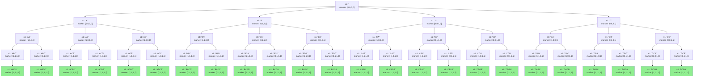

# String Permutation - `"ABCD"`

```mermaid
flowchart TD
    R["s1: ''<br/>marker: [0,0,0,0]"]
    
    R --> A["s1: 'A'<br/>marker: [1,0,0,0]"]
    R --> B["s1: 'B'<br/>marker: [0,1,0,0]"]
    R --> C["s1: 'C'<br/>marker: [0,0,1,0]"]
    R --> D["s1: 'D'<br/>marker: [0,0,0,1]"]
    
    A --> AB["s1: 'AB'<br/>marker: [1,1,0,0]"]
    A --> AC["s1: 'AC'<br/>marker: [1,0,1,0]"]
    A --> AD["s1: 'AD'<br/>marker: [1,0,0,1]"]
    
    AB --> ABC["s1: 'ABC'<br/>marker: [1,1,1,0]"]
    AB --> ABD["s1: 'ABD'<br/>marker: [1,1,0,1]"]
    
    AC --> ACB["s1: 'ACB'<br/>marker: [1,1,1,0]"]
    AC --> ACD["s1: 'ACD'<br/>marker: [1,0,1,1]"]
    
    AD --> ADB["s1: 'ADB'<br/>marker: [1,1,0,1]"]
    AD --> ADC["s1: 'ADC'<br/>marker: [1,0,1,1]"]
    
    ABC --> ABCD["s1: 'ABCD'<br/>marker: [1,1,1,1]"]
    ABD --> ABDC["s1: 'ABDC'<br/>marker: [1,1,1,1]"]
    ACB --> ACBD["s1: 'ACBD'<br/>marker: [1,1,1,1]"]
    ACD --> ACDB["s1: 'ACDB'<br/>marker: [1,1,1,1]"]
    ADB --> ADBC["s1: 'ADBC'<br/>marker: [1,1,1,1]"]
    ADC --> ADCB["s1: 'ADCB'<br/>marker: [1,1,1,1]"]
    
    B --> BA["s1: 'BA'<br/>marker: [1,1,0,0]"]
    B --> BC["s1: 'BC'<br/>marker: [0,1,1,0]"]
    B --> BD["s1: 'BD'<br/>marker: [0,1,0,1]"]
    
    BA --> BAC["s1: 'BAC'<br/>marker: [1,1,1,0]"]
    BA --> BAD["s1: 'BAD'<br/>marker: [1,1,0,1]"]
    
    BC --> BCA["s1: 'BCA'<br/>marker: [1,1,1,0]"]
    BC --> BCD["s1: 'BCD'<br/>marker: [0,1,1,1]"]
    
    BD --> BDA["s1: 'BDA'<br/>marker: [1,1,0,1]"]
    BD --> BDC["s1: 'BDC'<br/>marker: [0,1,1,1]"]
    
    BAC --> BACD["s1: 'BACD'<br/>marker: [1,1,1,1]"]
    BAD --> BADC["s1: 'BADC'<br/>marker: [1,1,1,1]"]
    BCA --> BCAD["s1: 'BCAD'<br/>marker: [1,1,1,1]"]
    BCD --> BCDA["s1: 'BCDA'<br/>marker: [1,1,1,1]"]
    BDA --> BDAC["s1: 'BDAC'<br/>marker: [1,1,1,1]"]
    BDC --> BDCA["s1: 'BDCA'<br/>marker: [1,1,1,1]"]
    
    C --> CA["s1: 'CA'<br/>marker: [1,0,1,0]"]
    C --> CB["s1: 'CB'<br/>marker: [0,1,1,0]"]
    C --> CD["s1: 'CD'<br/>marker: [0,0,1,1]"]
    
    CA --> CAB["s1: 'CAB'<br/>marker: [1,1,1,0]"]
    CA --> CAD["s1: 'CAD'<br/>marker: [1,0,1,1]"]
    
    CB --> CBA["s1: 'CBA'<br/>marker: [1,1,1,0]"]
    CB --> CBD["s1: 'CBD'<br/>marker: [0,1,1,1]"]
    
    CD --> CDA["s1: 'CDA'<br/>marker: [1,0,1,1]"]
    CD --> CDB["s1: 'CDB'<br/>marker: [0,1,1,1]"]
    
    CAB --> CABD["s1: 'CABD'<br/>marker: [1,1,1,1]"]
    CAD --> CADB["s1: 'CADB'<br/>marker: [1,1,1,1]"]
    CBA --> CBAD["s1: 'CBAD'<br/>marker: [1,1,1,1]"]
    CBD --> CBDA["s1: 'CBDA'<br/>marker: [1,1,1,1]"]
    CDA --> CDAB["s1: 'CDAB'<br/>marker: [1,1,1,1]"]
    CDB --> CDBA["s1: 'CDBA'<br/>marker: [1,1,1,1]"]
    
    D --> DA["s1: 'DA'<br/>marker: [1,0,0,1]"]
    D --> DB["s1: 'DB'<br/>marker: [0,1,0,1]"]
    D --> DC["s1: 'DC'<br/>marker: [0,0,1,1]"]
    
    DA --> DAB["s1: 'DAB'<br/>marker: [1,1,0,1]"]
    DA --> DAC["s1: 'DAC'<br/>marker: [1,0,1,1]"]
    
    DB --> DBA["s1: 'DBA'<br/>marker: [1,1,0,1]"]
    DB --> DBC["s1: 'DBC'<br/>marker: [0,1,1,1]"]
    
    DC --> DCA["s1: 'DCA'<br/>marker: [1,0,1,1]"]
    DC --> DCB["s1: 'DCB'<br/>marker: [0,1,1,1]"]
    
    DAB --> DABC["s1: 'DABC'<br/>marker: [1,1,1,1]"]
    DAC --> DACB["s1: 'DACB'<br/>marker: [1,1,1,1]"]
    DBA --> DBAC["s1: 'DBAC'<br/>marker: [1,1,1,1]"]
    DBC --> DBCA["s1: 'DBCA'<br/>marker: [1,1,1,1]"]
    DCA --> DCAB["s1: 'DCAB'<br/>marker: [1,1,1,1]"]
    DCB --> DCBA["s1: 'DCBA'<br/>marker: [1,1,1,1]"]
    
    style ABCD fill:#90EE90
    style ABDC fill:#90EE90
    style ACBD fill:#90EE90
    style ACDB fill:#90EE90
    style ADBC fill:#90EE90
    style ADCB fill:#90EE90
    style BACD fill:#90EE90
    style BADC fill:#90EE90
    style BCAD fill:#90EE90
    style BCDA fill:#90EE90
    style BDAC fill:#90EE90
    style BDCA fill:#90EE90
    style CABD fill:#90EE90
    style CADB fill:#90EE90
    style CBAD fill:#90EE90
    style CBDA fill:#90EE90
    style CDAB fill:#90EE90
    style CDBA fill:#90EE90
    style DABC fill:#90EE90
    style DACB fill:#90EE90
    style DBAC fill:#90EE90
    style DBCA fill:#90EE90
    style DCAB fill:#90EE90
    style DCBA fill:#90EE90
```
